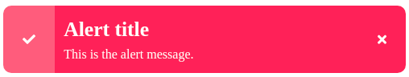

# Alert version 1

## Technologies
* HTML
* Vanilla JavaScript
* CSS3

## Installation

This project can be installed by downloading the zip project and extracting on your web server projects folder.

## Usage

### Alert Danger

Just add the class `alert--danger` v1

## License
The Guess My Number is an open-source project license under the [MIT license](license)

