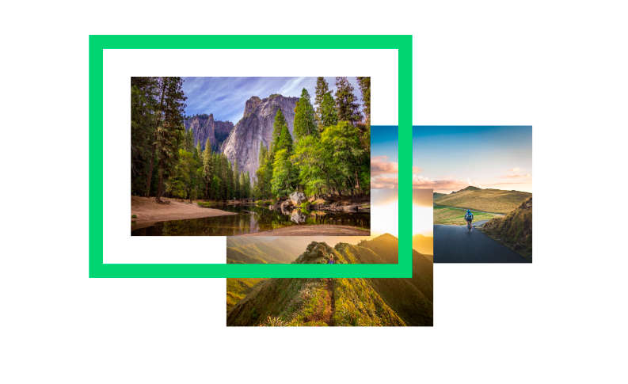
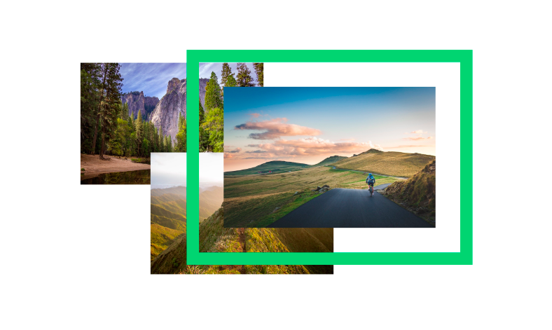

# Image Composition

This is a media componenent, a small collection of three image composition with cool efect.

## Examples

## Technologies
* HTML
* CSS3

## Dependecies
No _JavaScript_ or _CSS_ framework were used in this component.

## Installation
Copy and Paste the code on the [HTML](image_composition.html), [CSS](image_composition.css) file to your project or download the project.

## Usage

After copying the css and html, you can change the images url.

It is better to change the size of the images on the css file, using percentage values on the width propriate.

This is a block you have to use you own container to adjust the component to fit in your website.

## License
This is an open-source project license under the [MIT license](license)

